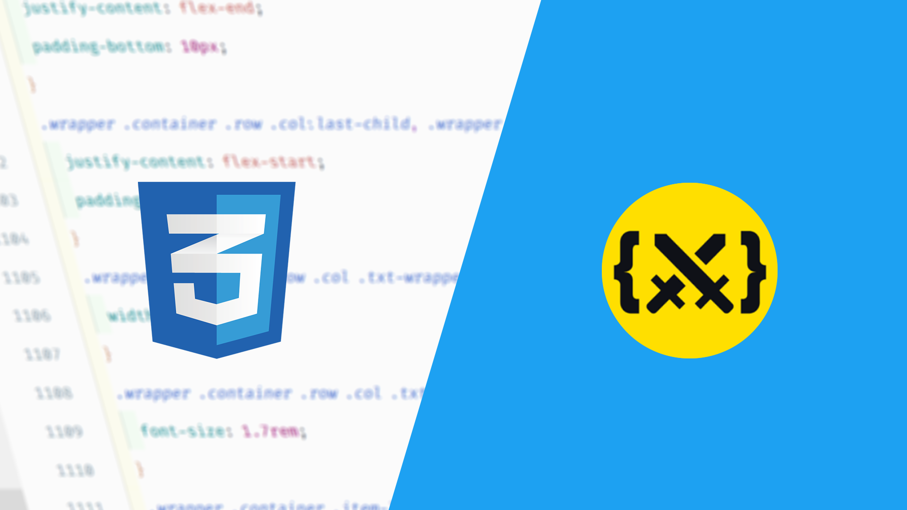

# Css Battle Challenges

A few suggested solutions for some cssbattle challenges

Visit [css-battle](https://cssbattle.dev/) website for more challenges

* Elephant - [Challenge Link](https://cssbattle.dev/play/71) / [Solution Link](https://github.com/DrissBoumlik/cssbattle.dev/tree/master/Elephant)
* Happy-Tiger - [Challenge Link](https://cssbattle.dev/play/73) / [Solution Link](https://github.com/DrissBoumlik/cssbattle.dev/tree/master/Happy-Tiger)
* Ice-Cream - [Challenge Link](https://cssbattle.dev/play/35) / [Solution Link](https://github.com/DrissBoumlik/cssbattle.dev/tree/master/Ice-Cream)
* PushOwl - [Challenge Link](https://cssbattle.dev/play/69) / [Solution Link](https://github.com/DrissBoumlik/cssbattle.dev/tree/master/PushOwl)
* Ukulele - [Challenge Link](https://cssbattle.dev/play/78) / [Solution Link](https://github.com/DrissBoumlik/cssbattle.dev/tree/master/Ukulele)
* Acid-Rain - [Challenge Link](https://cssbattle.dev/play/5) / [Solution Link](https://github.com/DrissBoumlik/cssbattle.dev/tree/master/Acid-Rain)
* Leafy-Trail - [Challenge Link](https://cssbattle.dev/play/7) / [Solution Link](https://github.com/DrissBoumlik/cssbattle.dev/tree/master/Leafy-Trail)
* Mountains - [Challenge Link](https://cssbattle.dev/play/46) / [Solution Link](https://github.com/DrissBoumlik/cssbattle.dev/tree/master/Mountains)
* Pokeball - [Challenge Link](https://cssbattle.dev/play/95) / [Solution Link](https://github.com/DrissBoumlik/cssbattle.dev/tree/master/Pokeball)
* Stay-at-Home - [Challenge Link](https://cssbattle.dev/play/49) / [Solution Link](https://github.com/DrissBoumlik/cssbattle.dev/tree/master/Stay-at-Home)
* Sunset - [Challenge Link](https://cssbattle.dev/play/62) / [Solution Link](https://github.com/DrissBoumlik/cssbattle.dev/tree/master/Sunset)
* Baby - [Challenge Link](https://cssbattle.dev/play/42) / [Solution Link](https://github.com/DrissBoumlik/cssbattle.dev/tree/master/Baby)
* Blossom - [Challenge Link](https://cssbattle.dev/play/25) / [Solution Link](https://github.com/DrissBoumlik/cssbattle.dev/tree/master/Blossom)
* Totally-Triangle - [Challenge Link](https://cssbattle.dev/play/13) / [Solution Link](https://github.com/DrissBoumlik/cssbattle.dev/tree/master/Totally-Triangle)
* Web-Maker-Logo - [Challenge Link](https://cssbattle.dev/play/14) / [Solution Link](https://github.com/DrissBoumlik/cssbattle.dev/tree/master/Web-Maker-Logo)
* Lock-Up - [Challenge Link](https://cssbattle.dev/play/27) / [Solution Link](https://github.com/DrissBoumlik/cssbattle.dev/tree/master/Lock-Up)
* Switches - [Challenge Link](https://cssbattle.dev/play/24) / [Solution Link](https://github.com/DrissBoumlik/cssbattle.dev/tree/master/Switches)
* Building-Blocks - [Challenge Link](https://cssbattle.dev/play/87) / [Solution Link](https://github.com/DrissBoumlik/cssbattle.dev/tree/master/Building-Blocks)
* Snowman - [Challenge Link](https://cssbattle.dev/play/97) / [Solution Link](https://github.com/DrissBoumlik/cssbattle.dev/tree/master/Snowman)
* Equals - [Challenge Link](https://cssbattle.dev/play/31) / [Solution Link](https://github.com/DrissBoumlik/cssbattle.dev/tree/master/Equals)
* Bell - [Challenge Link](https://cssbattle.dev/play/68) / [Solution Link](https://github.com/DrissBoumlik/cssbattle.dev/tree/master/Bell)
* Door-Knob - [Challenge Link](https://cssbattle.dev/play/64) / [Solution Link](https://github.com/DrissBoumlik/cssbattle.dev/tree/master/Door-Knob)
* Max-Volume - [Challenge Link](https://cssbattle.dev/play/65) / [Solution Link](https://github.com/DrissBoumlik/cssbattle.dev/tree/master/Max-Volume)
* Piano - [Challenge Link](https://cssbattle.dev/play/80) / [Solution Link](https://github.com/DrissBoumlik/cssbattle.dev/tree/master/Piano)
* Suffocate - [Challenge Link](https://cssbattle.dev/play/29) / [Solution Link](https://github.com/DrissBoumlik/cssbattle.dev/tree/master/Suffocate)
* Command-Key - [Challenge Link](https://cssbattle.dev/play/63) / [Solution Link](https://github.com/DrissBoumlik/cssbattle.dev/tree/master/Command-Key)
* Corona-Virus - [Challenge Link](https://cssbattle.dev/play/47) / [Solution Link](https://github.com/DrissBoumlik/cssbattle.dev/tree/master/Corona-Virus)
* Eye-of-the-Tiger - [Challenge Link](https://cssbattle.dev/play/16) / [Solution Link](https://github.com/DrissBoumlik/cssbattle.dev/tree/master/Eye-of-the-Tiger)
* Cups-&-Balls - [Challenge Link](https://cssbattle.dev/play/28) / [Solution Link](https://github.com/DrissBoumlik/cssbattle.dev/tree/master/Cups-&-Balls)
* Horizon - [Challenge Link](https://cssbattle.dev/play/30) / [Solution Link](https://github.com/DrissBoumlik/cssbattle.dev/tree/master/Horizon)
* Simply-Square - [Challenge Link](https://cssbattle.dev/play/1) / [Solution Link](https://github.com/DrissBoumlik/cssbattle.dev/tree/master/Simply-Square)
* Ups-and-Downs - [Challenge Link](https://cssbattle.dev/play/4) / [Solution Link](https://github.com/DrissBoumlik/cssbattle.dev/tree/master/Ups-and-Downs)
* Cloaked-Spirits - [Challenge Link](https://cssbattle.dev/play/10) / [Solution Link](https://github.com/DrissBoumlik/cssbattle.dev/tree/master/Cloaked-Spirits)
* Missing-Slice - [Challenge Link](https://cssbattle.dev/play/6) / [Solution Link](https://github.com/DrissBoumlik/cssbattle.dev/tree/master/Missing-Slice)
* Tesseract - [Challenge Link](https://cssbattle.dev/play/9) / [Solution Link](https://github.com/DrissBoumlik/cssbattle.dev/tree/master/Tesseract)
* Sharingan - [Challenge Link](https://cssbattle.dev/play/101) / [Solution Link](https://github.com/DrissBoumlik/cssbattle.dev/tree/master/Sharingan)
* Eclipse - [Challenge Link](https://cssbattle.dev/play/90) / [Solution Link](https://github.com/DrissBoumlik/cssbattle.dev/tree/master/Eclipse)
* Gift-Box - [Challenge Link](https://cssbattle.dev/play/99) / [Solution Link](https://github.com/DrissBoumlik/cssbattle.dev/tree/master/Gift-Box)
* Hippo - [Challenge Link](https://cssbattle.dev/play/75) / [Solution Link](https://github.com/DrissBoumlik/cssbattle.dev/tree/master/Hippo)
* Ripples - [Challenge Link](https://cssbattle.dev/play/94) / [Solution Link](https://github.com/DrissBoumlik/cssbattle.dev/tree/master/Ripples)
* Pythagoras - [Challenge Link](https://cssbattle.dev/play/85) / [Solution Link](https://github.com/DrissBoumlik/cssbattle.dev/tree/master/Pythagoras)
* Junction - [Challenge Link](https://cssbattle.dev/play/84) / [Solution Link](https://github.com/DrissBoumlik/cssbattle.dev/tree/master/Junction)
* Carrom - [Challenge Link](https://cssbattle.dev/play/2) / [Solution Link](https://github.com/DrissBoumlik/cssbattle.dev/tree/master/Carrom)
* Interleaved - [Challenge Link](https://cssbattle.dev/play/36) / [Solution Link](https://github.com/DrissBoumlik/cssbattle.dev/tree/master/Interleaved)
* Boxception - [Challenge Link](https://cssbattle.dev/play/23) / [Solution Link](https://github.com/DrissBoumlik/cssbattle.dev/tree/master/Boxception)
* Push-Button - [Challenge Link](https://cssbattle.dev/play/3) / [Solution Link](https://github.com/DrissBoumlik/cssbattle.dev/tree/master/Push-Button)
* Supernova - [Challenge Link](https://cssbattle.dev/play/83) / [Solution Link](https://github.com/DrissBoumlik/cssbattle.dev/tree/master/Supernova)
* Pastel-Logo - [Challenge Link](https://cssbattle.dev/play/53) / [Solution Link](https://github.com/DrissBoumlik/cssbattle.dev/tree/master/Pastel-Logo)
* Windmill - [Challenge Link](https://cssbattle.dev/play/55) / [Solution Link](https://github.com/DrissBoumlik/cssbattle.dev/tree/master/Windmill)
* Wash-Your-Hands - [Challenge Link](https://cssbattle.dev/play/48) / [Solution Link](https://github.com/DrissBoumlik/cssbattle.dev/tree/master/Wash-Your-Hands)
